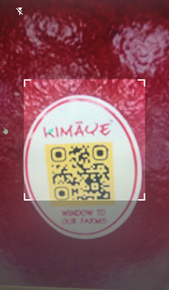
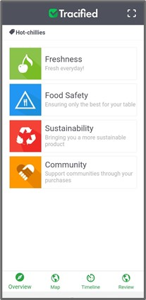
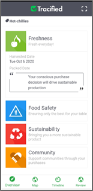
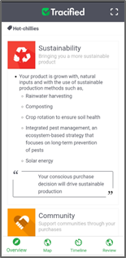
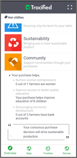
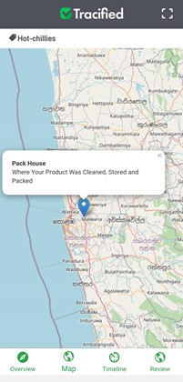
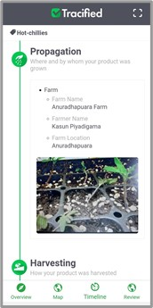
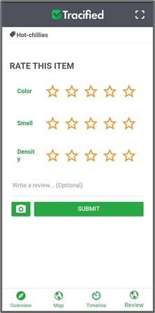
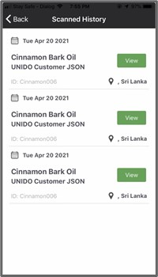

# Consumer App

import DocsRating from '@site/src/core/DocsRating';

Tracified Consumer App can be downloaded from the Google play store or Apple app store through the following links.

**Google Play Store - https://play.google.com/store/apps/details?id=com.tracified.app.customer&hl=en&gl=US**

**Apple App Store - https://apps.apple.com/lk/app/tracified/id1563877961 **

Tracified Consumer App can be used by consumers in order to view the traceability data during each and every stage of the supply chain process, to view the origin, safety, sustainability, and communities supported, and to rate products.

Once logged in successfully, it will be asked to scan the QR code on the product.

All the details of the scanned product including the stages and all relevant information can be found here.

## Overview

Four collapsible cards are published in order to retrieve and display information about the nature and safety of the product, sustainability practices followed and the communities which were involved in the process.

  

## Map

A zoomable map is displayed which will extract the geo-locations of the images that have been uploaded for each stage of the supply chain.

## Timeline

The Series of stages through which the product went through during its lifecycle, along with the required information per stage will be displayed here.

## Review

Consumers can add ratings according to the aspects defined and also can add a comment and can even upload images of the product as proof of quality.

The added ratings and comments will be displayed on the screen as above.

## Scanned History

The history of the products scanned recently through the app can be viewed here.
When clicked on the **‘View’** button, overall descriptions of the products will be displayed.

<DocsRating pageName="certificates"/>
