# Field Officer App

import DocsRating from '@site/src/core/DocsRating';

Tracified Field Officer App can be downloaded from the Google play store or Apple app store through the following links.

**Google Play Store - https://play.google.com/store/apps/details?id=com.tracified.app.officer**

** Apple App Store - https://apps.apple.com/lk/app/tracified-field-officer/id1549877752**

Tracified Field Officer App is the most prominently used portal to enter traceability data to the system.

Use the credentials used when creating the Tracified Accounts to log into the application. Once logged in successfully, you will be able to carry out all the available functionalities.

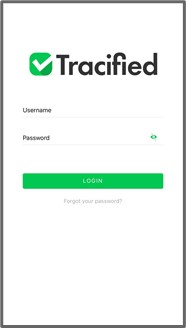 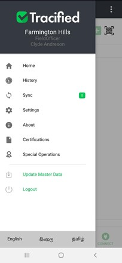

## Home

Enter a batch ID or scan the QR code, to proceed adding data to the system. You will be able to do four major functionalities; adding data, stage transferring, splitting batches and connecting batches

  

    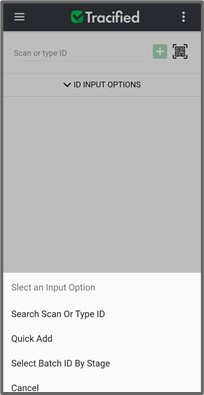
  

## Add Data

Tap on the **‘Add’** option to add traceability data to the system.

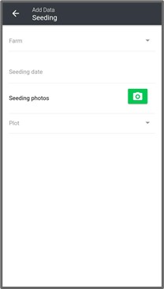 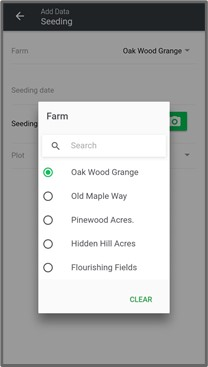 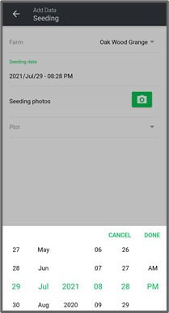

- Once all the data related to the particular stage is filled and an image related to each stage is uploaded, click on the submit button to save the added data.

- You will be asked to confirm adding data or to cancel in order to terminate the
  action.

- Once clicked on the **‘Submit’** button, you will be asked to enter the transaction password.

- Enter the provided transaction password and click on **‘OK’** to successfully add data to the system.

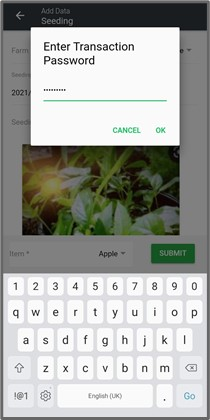

## Transfer

Click on the **‘transfer’** option to transfer stages of the supply chain process. 
Select the stage to which the product should be transferred and select the particular product and click on the **‘Transfer Stage’** button. 

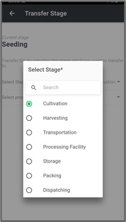

## Split

Click on the **‘Split’** option to split a particular batch into two separate batches.

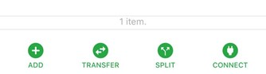

Type the ID or scan the QR code and then select the product and tap on the ‘Release Parent ID’ radio button (if needed) and tap on **‘Split**’ button.

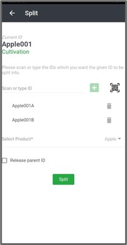

This will split the selected batch into two separate batches.

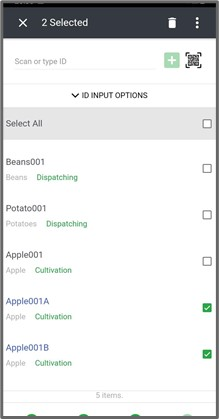

## Connect

This connect option allows you to merge two batches together. Click on the **‘Connect’** option

Type or scan the ID and then a new ID will be generated. Then select the other product that needs to be connected and click on **‘Connect ID**’. There onwards the new ID will be used to proceed in transactions. 

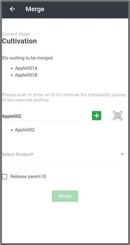 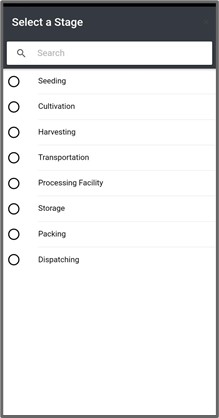

## History

This will display the details of the recent transactions which took place such as the item name, current stage, added date and related identifiers.

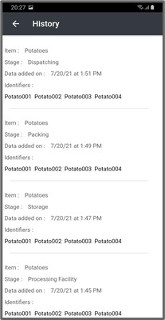 

## Sync
Locally stored data can be synced with the Tracified FO App, only if available.

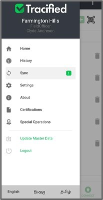 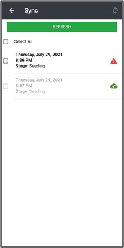 

## Settings

UserProfile Settings can be changed through this screen. Name of the user can be changed and a new password can be created here. 

The transaction password can also be changed as per the requirement.

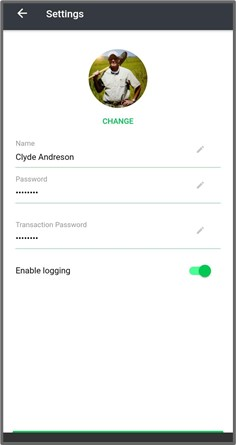 

## About

This showcases the current version of the application and any updates if available.

 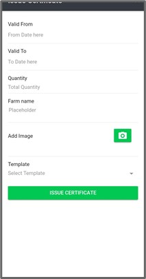 

## Certifications

Certifications can be issued here according to the requirement.

 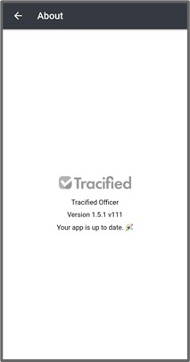 

## Special Operations

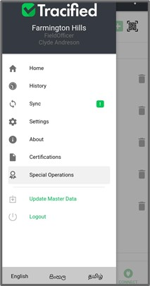 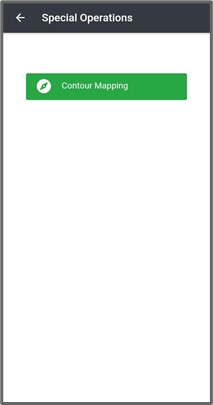 

## Update Master Data

Master data can be automatically updated once clicked on this option in the navigation menu. 

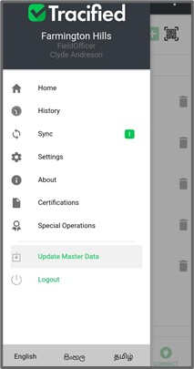 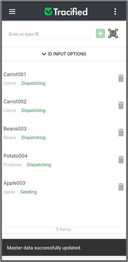 

## Logout

By tapping on the **‘Logout**’ option, you can conclude the use of FO app and can login again with the correct credentials whenever required.

## Language Selection

Tracified supports various languages including English, Sinhala, Tamil and many more. The preferred language can be chosen from the options given.

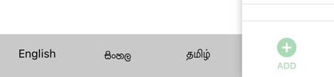 

<DocsRating pageName="certificates"/>
