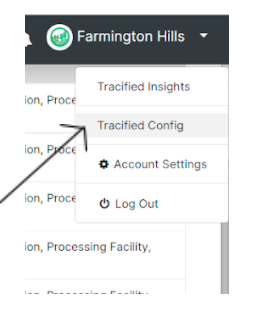

# Intro

- Tracified Configs Portal can be accessed via the Tracified Admin.

Tracified configs will be where the configurations made by the users to augment the system to their supply chain. This includes storage of  workflow and artifact configurations and Field Officer user interfaces. Tracified will allow the users to create their workflows ** through two options**.

1.	Using sample workflow and artifact templates.
2.	Creating workflows manually.

Lets add the option auto generate or manual creation.

When creating the workflows manually, artifacts should be defined first.
