# Workflow

import DocsRating from '@site/src/core/DocsRating';

Workflow creation can be done for all stages of the supply chain through Tracified Configs Portal.

You can add new stages to the process, as per your requirement, through the **'+ Stage ' **button.
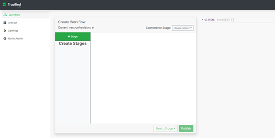

Add a stage name press ** Enter**

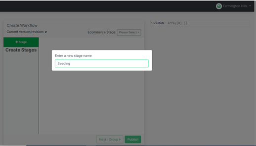

Select the newly created stage and you can add relevant fields to a particular stage through the ** '+ Field'** button.

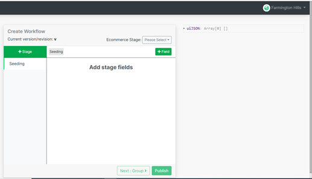

Enter an appropriate field name and press Enter.

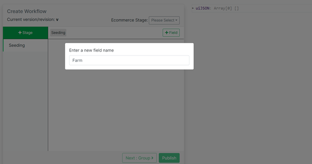

You can select the nature of the data as artifacts, list or single.

If you want to have your users add data using artifacts, you can choose the artifact function.

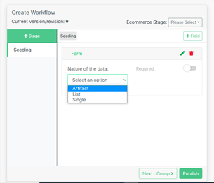 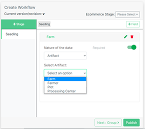

If you enable the ** ‘Required’** toggl button, filling the data fields will be mandatory.

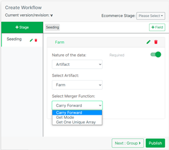

Select the Merger Function (recommended ‘Carry Forward’)

If the list is selected, you can enter list items as you need, or even remove them while creating and also can select the required merge function.

If you choose the ‘single’ option, it will let the field officer users enter the data type you configure here.

** Yes or No** - this option will enable the field officer users to check or uncheck the field.
Cascade option will allow you to

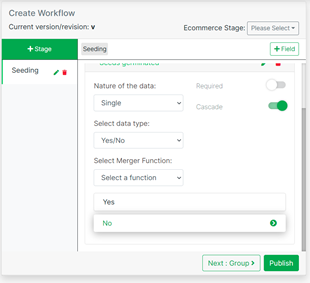 **Photo ** - this will enable the field officers to upload geo coded images.

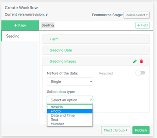 ** Date and Time** - this option will enable field officers to pick the date and time.

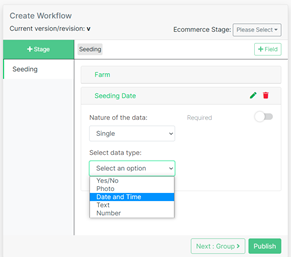 **Number ** - this option will enable the field officers to enter numerical values.

If you toggle the prefix and postfix, you can enter some text that should be available before or after the numerical value.
(ex: it can be a measurement unit or a value that is common to all)

** Text** - this option will enable the field officers to enter text

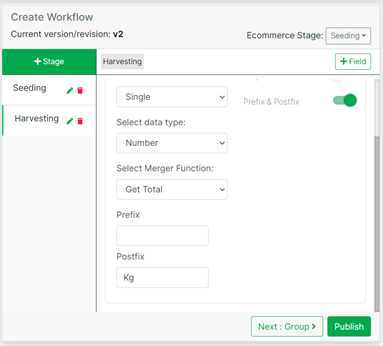

Here also you can enable the prefix and postfix option.

Once all these are correctly added, click on the ‘Publish’ button to get them added to the workflow. (This may sometimes take a while as the whole workflow process should be created within the system automatically)

One or more fields can be merged together to make a group. Click on the ‘Next: Group’ button to create a new group for the added fields.

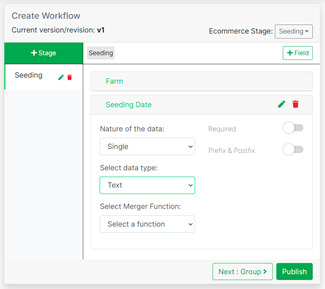

Drag and drop the required fields to be grouped together to the dark grey box, and click on ‘Add to Group’ button. Then you will be asked to enter a suitable name for the new group. Enter a meaningful name and just click enter to make them grouped successfully.

You can now publish the group by clicking on the **‘Publish’ ** button. Then you will see an alert saying the process was successfully completed.

<DocsRating pageName="certificates"/>
