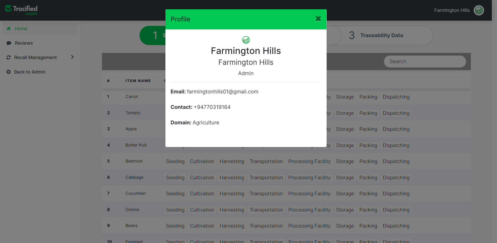
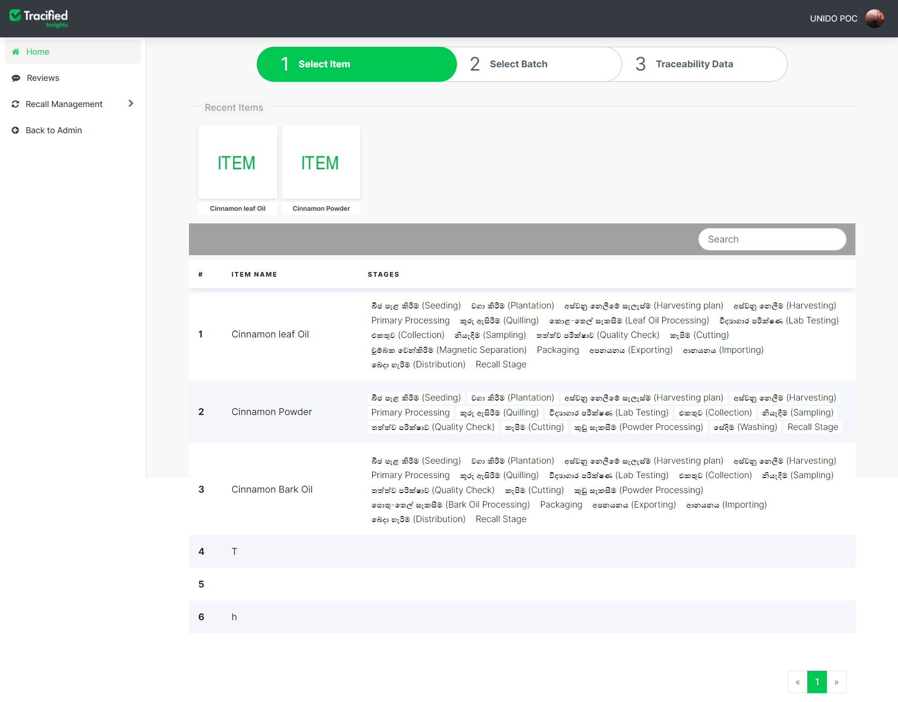
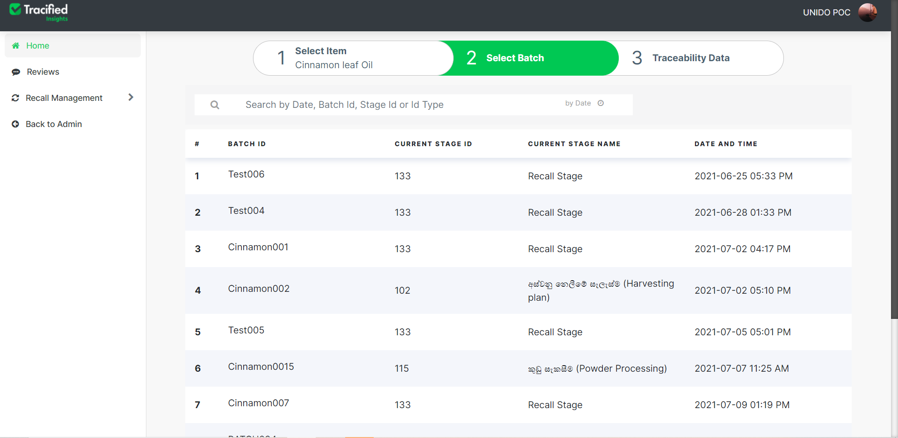
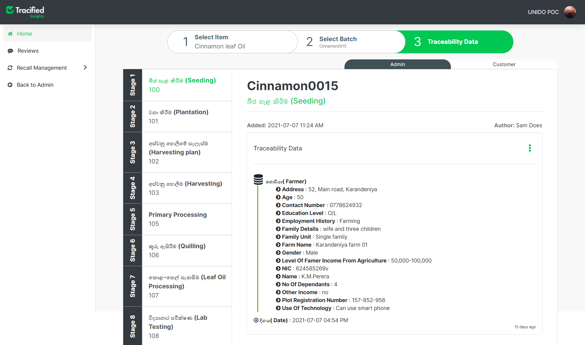
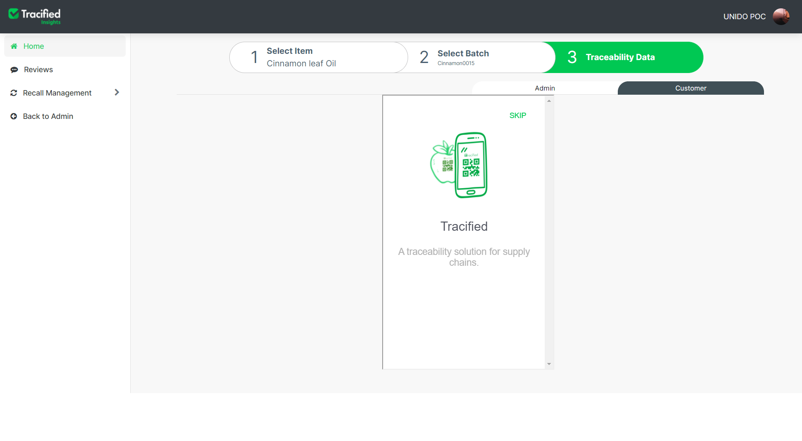
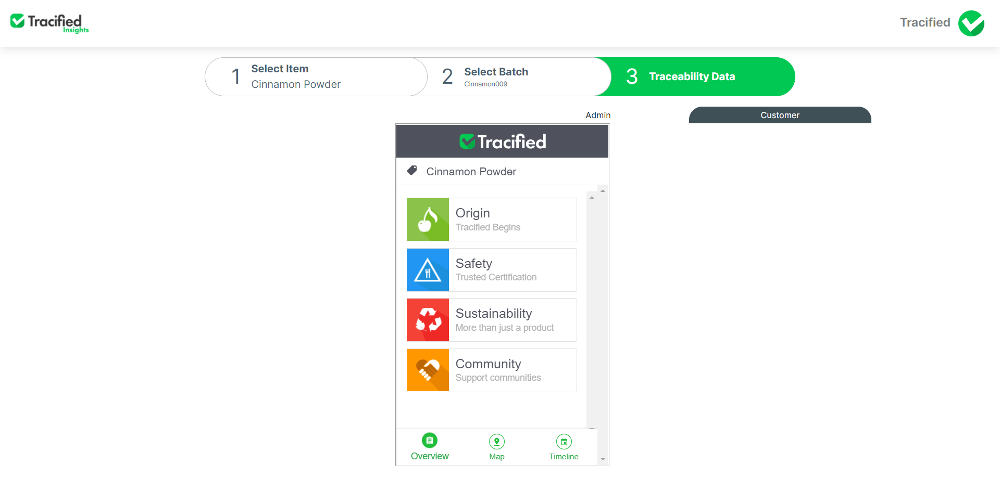
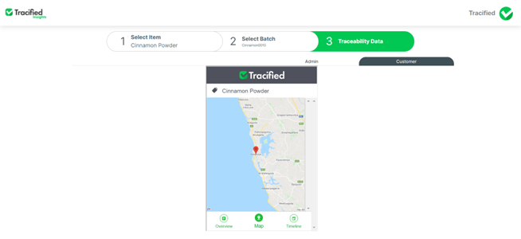
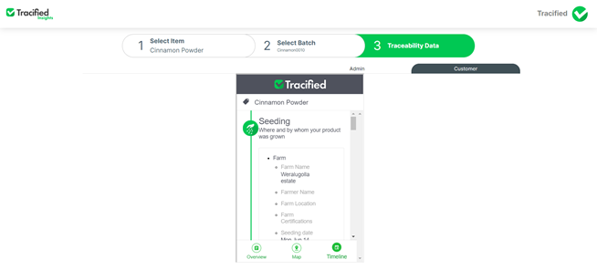

# Home
import DocsRating from '@site/src/core/DocsRating';

- Tracified Insights Portal is the platform through which registered users can view traceability data, reviews and feedback and also to recall batches and items.

## Home Page

The landing page for the Tracified Insights Portal is the home page. The recorded Tracified Items will be displayed along with their appropriate stages. 

## User Profile

When clicked on the username at the top right corner of the screen, an expandable menu will be displayed. 

When clicked on the ‘Profile’ option, profile details will be displayed as follows. 

## Selecting an Item

One a specific item is selected, it will be automatically redirected to the ‘Select Batch’ section, where you can choose the required batch to view traceability data. You can either search the batch by inserting the batch ID or date at the search field or either can directly click on the relevant batch from the display table below. 

## Selecting a batch

Once the batch is selected, all the recorded traceability data by the field officers for each stage of the supply chain will be visible in the admin panel. 

## Viewing Traceability Data

This is a preview of the consumer view.
You can also view the consumer perspective of the selected batch by clicking the ‘Consumer’ tab from the panel.

You can swipe left to see the consumer preview or can just skip the slideshow and directly view.

An entire overview of the product including its origin, its safety approved certifications, sustainable practices and how it supports the community can be viewed from each option. 

The map extracts and displays the geo locations of images that have been uploaded for each stage.
The map can be zoomed in and out to view the locations. 

The timeline section depicts all traceability data of each and every stage of the supply chain process. You can scroll down to view all stages and their data, in a well concise and a transparent manner. 

<DocsRating pageName="certificates"/>

 

